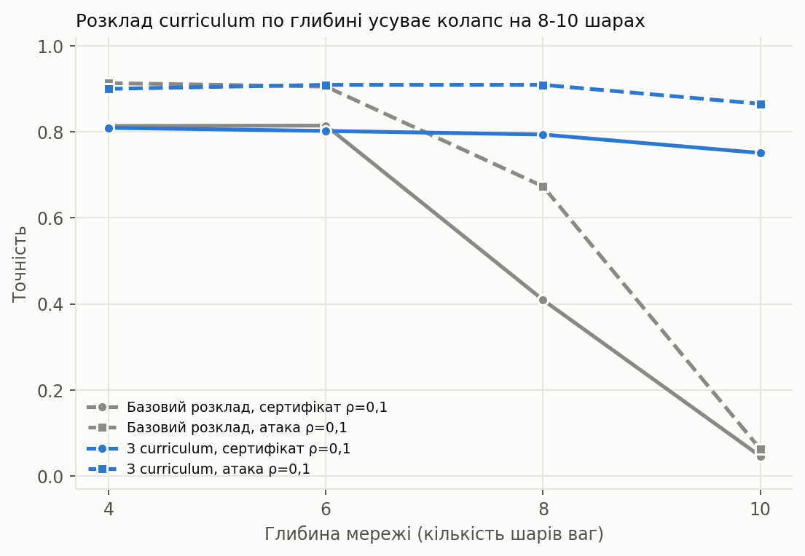

# Інтервальне навчання нейронних мереж (коридор ваг + γ)

Реалізація та експериментальна перевірка методу сертифікованого навчання нейронних
мереж, стійких до відносних збурень ваг. Код лежить в основі тез на студентську
конференцію, наукової статті та дипломної роботи. Матеріал нижче містить технічний
опис методу, структуру репозиторію та отримані результати.

## Метод

Кожна вага $w_{ij}$ шару $l$ під час навчання розглядається не як фіксоване число, а як
така, що може набувати будь-якого значення в межах відносного коридору:

$$
w_{ij} \in \left[\, C_{ij} - s_l |C_{ij}|,\ \ C_{ij} + s_l |C_{ij}| \,\right], \qquad s_l = \rho \cdot \gamma_l
$$

Тут $C$ це навчений центр ваги, $\rho$ це базовий радіус коридору, а $\gamma_l$ це
коефіцієнт диверсифікації, що дозволяє задавати різну ширину коридору для різних шарів.

Мережа навчається мінімізувати не точкову похибку, а похибку на найгіршому випадку в
межах коридору. Найгірші логіти обчислюються точно (без семплювання) через інтервальне
поширення меж (Interval Bound Propagation, IBP): замість одного значення кожен нейрон
несе пару (центр, радіус), і ці межі поширюються через усі шари, включно з ReLU.
Функція втрат це суміш звичайної крос-ентропії на точних вагах і крос-ентропії на
найгіршому випадку; радіус коридору лінійно наростає від 0 протягом перших 40 %
навчання (стандартний прийом для стабілізації IBP-навчання).

Якщо для тестового прикладу нижня межа логіта правильного класу перевищує верхні межі
логітів усіх інших класів, це називається **сертифікатом**: клас не може змінитися за
жодного значення ваг у коридорі, для будь-якого значення ρ, без емпіричної перевірки.

## Перевірка чесності сертифіката

Окремо від сертифіката для кожної навченої мережі проводиться **емпірична атака**:
градієнтний підйом (з двох стартових точок) у тому самому коридорі ваг, що підбирає
найгірші можливі ваги вручну. Сертифікат це гарантована нижня межа стійкості, а атака
це оцінка зверху. Узгодженість цих двох чисел (розділ «Результати») підтверджує, що
сертифікат не є артефактом слабкого способу обчислення меж.

## Структура репозиторію

```
interval_nn/
  layers.py            Dense і ResDense: точковий та інтервальний прохід, градієнти вручну
  model.py              MLP, ModelFactory (Factory Method), включно з build_resnet
  diversity.py            профілі γ: Constant, Linear, Exponential (Strategy)
  strategies.py            стратегії навчання: Backprop, Interval, WeightNoise, PNI, L1, NoiseAug (Strategy)
  bbb.py                     Bayes by Backprop: окрема реалізація (див. «Baseline-и»)
  monitor.py                  TrainingMonitor + підписники (Observer)
  data.py                      завантаження цифр і MNIST, шум, батчі (Adapter)
  evaluate.py                    метрики: точність, сертифікат, атака, шум, квантування, прунінг

tests/
  test_interval.py       коректність меж, градієнти IntervalStrategy (finite-difference)
  test_baselines.py       градієнти PNIStrategy (log_alpha) і BBB (mu, rho) (finite-difference)
  test_resnet.py           градієнти ResDense, регуляризації ширини і curriculum (finite-difference)

run_experiment.py       основний бенчмарк: 10 конфігурацій навчання x N seed-ів
run_alpha_sweep.py      вплив крутизни профілю γ
run_controls.py         порівняння з L1-регуляризацією
run_frontier.py         компроміс чиста/сертифікована точність як функція ρ_train
run_attack.py           градієнтна атака на ваги, перевірка сертифіката
run_extra_baselines.py  порівняння з PNI і Bayes by Backprop
run_depth.py            той самий метод на мережах глибиною 4/6/8/10 шарів ваг
run_depth_fix.py        те саме, з ResDense / регуляризацією ширини / curriculum по глибині

make_figures.py, make_frontier_figure.py, make_attack_figure.py, make_depth_figure.py,
make_depth_fix_figure.py
                        генерація графіків із результатів відповідних run_*.py

results/, results_v2/, results_v3/   сирі csv і готові графіки за кожним запуском
```

## Запуск

Залежності: лише NumPy, scikit-learn (датасет цифр і завантаження MNIST) і matplotlib
для графіків. Жодних градієнтів у сторонніх бібліотеках, усі виведені вручну й
перевірені finite-difference тестами.

```bash
pip install numpy scikit-learn matplotlib

python -m unittest discover -s tests -v      # 16 тестів: межі, градієнти всіх стратегій і ResDense

python run_experiment.py --dataset digits --seeds 10 --normalize params
python run_frontier.py --dataset mnist --seeds 10 --epochs 15 --batch 128
python run_attack.py --dataset digits --seeds 3 --n-test 200
python run_extra_baselines.py --seeds 5 --epochs 80
python run_depth.py --seeds 5 --epochs 160
python run_depth_fix.py --seeds 5 --epochs 160 --depths 4 6 8 10 \
    --arch plain --depth-curriculum --curriculum-span 0.05 --tag final
```

MNIST завантажується через `sklearn.datasets.fetch_openml` і потребує інтернету при
першому запуску.

## Результати

Цифри 8×8 (scikit-learn) і MNIST, по 10 незалежних запусків кожен, поправка Холма на
множинні порівняння.

**Основний результат.** При $\rho_{\text{train}} = 0{,}1$ (константний профіль $\gamma$) мережа отримує
сертифіковану точність 81–95 % проти реального збурення ваг у 5–10 % практично без
втрати чистої точності (0,97–0,98 проти 0,97–0,98 у звичайної мережі). Звичайний
Backprop і мережа, навчена на випадкових вагах з того самого коридору (weight-noise),
мають сертифікат 0 %, тобто жодної гарантії. Атака підтверджує сертифікат: для
інтервальної мережі атакована точність (0,92–0,95) практично збігається з сертифікатом,
тоді як Backprop атака руйнує до 0,1–1 % точності.

**Baseline-и: PNI і Bayes by Backprop** (`run_extra_baselines.py`, цифри 8×8, 5 seed-ів,
80 епох). Жоден з них не дає формального сертифіката, оскільки обидва конструюються
навколо розподілу чи шуму, а не навколо точних інтервальних меж:

| Метод | Чиста точність | Сертифікат ρ=0,05 | Атака ρ=0,05 | Сертифікат ρ=0,1 | Атака ρ=0,1 | p=0,9 (прунінг) |
|---|---|---|---|---|---|---|
| Backprop | 0,974 | 0,000 | 0,001 | 0,000 | 0,000 | 0,187 |
| Weight-noise (ρ=0,1) | 0,975 | 0,000 | 0,008 | 0,000 | 0,000 | 0,172 |
| **Інтервальне, ρ=0,1** | 0,975 | **0,942** | 0,949 | **0,846** | 0,917 | 0,567 |
| PNI | 0,979 | 0,000 | 0,073 | 0,000 | 0,000 | 0,215 |
| Bayes by Backprop | 0,979 | н/д | н/д | н/д | н/д | 0,339 |

PNI (навчений per-layer масштаб шуму) дає невеликий приріст емпіричної стійкості при
малому коридорі (0,073 проти 0,001 у Backprop при ρ=0,05), але повністю руйнується при
ρ=0,1, так само, як і звичайний Backprop. Bayes by Backprop не має шляху для обчислення
формальних меж (немає інтервального поширення через варіаційний розподіл ваг у цій
реалізації), але апостеріорні ваги виявляються помітно стійкішими до прунінгу (0,339
проти 0,172–0,215 в інших baseline-ів): це схожий, хоч і слабший, ефект до того, що дає
інтервальне навчання (0,567). Жоден з двох методів не наближається до сертифікованої
гарантії інтервального навчання.

*Технічна примітка.* Наївна рівномірна вага KL-доданка $\left(\dfrac{1}{n_{\text{batches}}}\right)$ у Bayes by Backprop
повністю руйнувала навчання (точність на рівні випадкового вгадування): складність
KL-доданка (тисячі nat для мережі з ~9000 ваг) на порядки перевищувала крос-ентропію.
Виправлено експоненційною вагою мінібатчів $2^{-(i+1)}$ за Blundell et al. (2015, §3.4),
застосованою по глобальному індексу батча за весь прогін навчання, а не по кожній епосі
окремо: скидання лічильника щоепохи повторно тягне ваги до апріорного середнього і за
багато епох поступово стирає вивчене.

**Глибина мережі** (`run_depth.py`, цифри 8×8, 5 seed-ів, той самий $\rho_{\text{train}} = 0{,}1$,
однакова архітектурна схема для кожної глибини):

| Глибина (шарів ваг) | Чиста точність | Сертифікат ρ=0,05 | Атака ρ=0,05 | Сертифікат ρ=0,1 | Атака ρ=0,1 |
|---|---|---|---|---|---|
| 4 (базова) | 0,984 | 0,946 | 0,951 | 0,814 | 0,913 |
| 6 | 0,980 | 0,946 | 0,947 | 0,815 | 0,905 |
| 8 | 0,949 | 0,780 | 0,845 | 0,409 | 0,673 |
| 10 | 0,179 | 0,062 | 0,093 | 0,046 | 0,063 |

Підтверджується гіпотеза: межі IBP справді грубішають з глибиною. До 6 шарів ефект
практично відсутній, на 8 шарах сертифікат при ρ=0,1 падає вдвічі відносно чистої
точності (0,409 проти 0,949), а на 10 шарах пряме навчання з фіксованим $\rho_{\text{train}} = 0{,}1$
взагалі не збігається (точність лишається на рівні випадкового вгадування).

**Виправлення колапсу на глибині** (`run_depth_fix.py`). Причина колапсу: усі шари
починають наростання коридору одночасно (`ramp` спільний для всієї мережі), а похибка
IBP, внесена раннім шаром, проходить крізь усі наступні шари й компенсаційно
накопичується, тому найгірший випадок стає руйнівним ще до того, як пізні шари встигли
сформувати корисні ознаки. Перевірено три незалежні виправлення:

- **Залишкові (residual) зв'язки.** Мережа сталої ширини з тотожним обхідним шляхом на
  кожному прихованому шарі (`ResDense`, `ModelFactory.build_resnet`): вихід шару це
  $a + W \cdot a$, а не просто $W \cdot a$, тому коридор компенсаційно накопичується
  лише через галузь $W \cdot a$, а не через всю глибину. Інтервальна арифметика суми
  двох боксів (тотожність + галузь) додає центри й радіуси, це стандартне (коректне,
  хоч і трохи консервативне) IBP-правило для суми.
- **Регуляризація ширини інтервалу.** Штраф $\beta \cdot \sum_l \frac{1}{N_l} \lVert e_l
  \rVert_1$ на радіус активації $e_l$ кожного прихованого шару $l$ (з $N_l$ нейронами),
  з градієнтом виведеним вручну й перевіреним finite-difference тестом.
- **Розклад curriculum по глибині.** Замість того, щоб усі шари нарощували коридор
  одночасно, вихідні шари вмикаються першими, а вхідні останніми: шар $l$ починає
  власне наростання зі зсувом $\left(1 - \frac{l}{L-1}\right) \cdot \text{span}$
  відносно загального прогресу навчання (`IntervalStrategy(depth_curriculum=True,
  curriculum_span=...)`).

Абляція на глибині 10 (цифри 8×8, $\rho_{\text{train}} = 0{,}1$, 3 seed-и, `curriculum_span = 0,05`
там, де curriculum увімкнений) показала, що працює лише останній прийом, і сам по
собі, без зміни архітектури:

| Конфігурація | Сертифікат ρ=0,1 |
|---|---|
| Базовий розклад (без жодного з трьох прийомів) | 0,046 |
| Залишкові зв'язки (`resnet`) самі по собі | 0,024 |
| Регуляризація ширини сама по собі (звичайна мережа) | 0,054 |
| Регуляризація ширини сама по собі (`resnet`) | 0,022 |
| **Curriculum по глибині сам по собі (звичайна мережа)** | **0,751** |
| Curriculum по глибині + `resnet` | 0,795 |
| Curriculum по глибині + `resnet` + регуляризація | 0,777 |

І залишкові зв'язки, і регуляризація ширини самі по собі не зрушують колапс узагалі
(сертифікат лишається в межах шуму від нуля), а додавання будь-якого з них до
curriculum не дає статистично значущого покращення понад сам curriculum. Причина в
тому, що вони борються з наслідком (широкий інтервал на пізніх шарах), тоді як
curriculum усуває причину (усі шари одночасно намагаються навчитися під максимальний
найгірший випадок ще до того, як мережа взагалі навчилася чогось корисного).

Ширина зсуву `span` виявилась критичним параметром: нижче приблизно 0,03 curriculum не
встигає розвести шари вчасно і мережа знов колапсує (нестабільно, залежно від seed-а),
вище 0,04 навчання стабільно збігається на всіх перевірених глибинах. Фінальний прогін
(`curriculum_span = 0,05`, 5 seed-ів, $\rho_{\text{train}} = 0{,}1$, той самий базовий розклад
`ramp = 0,85, kappa = 0,9`, 160 епох):

| Глибина (шарів ваг) | Чиста точність | Сертифікат ρ=0,1 (було) | Сертифікат ρ=0,1 (з curriculum) | Атака ρ=0,1 |
|---|---|---|---|---|
| 4 | 0,980 | 0,814 | 0,809 | 0,900 |
| 6 | 0,980 | 0,815 | 0,802 | 0,909 |
| 8 | 0,978 | 0,409 | 0,794 | 0,909 |
| 10 | 0,957 | 0,046 | 0,751 | 0,865 |



Сертифікат тепер тримається у вузькому діапазоні 0,75–0,81 на всіх перевірених
глибинах замість катастрофічного падіння до 0,046 на 10 шарах: розклад curriculum
робить метод практично незалежним від глибини мережі ціною невеликої (у межах
статистичного розкиду) втрати сертифіката на неглибоких мережах. Залишкові зв'язки й
регуляризація ширини інтервалу лишаються в коді (`ResDense`, `IntervalStrategy.beta_reg`,
обидва з власними finite-difference тестами в `tests/test_resnet.py`) як перевірені,
але для цієї задачі зайві інструменти: чесний негативний результат, а не прихована
складність.

*Технічна примітка.* Під час перевірки градієнтів на цих глибших і ширших мережах
виявилась розбіжність між значенням функції втрат і її градієнтом у `softmax_ce`: щоб
уникнути `log(0)`, до ймовірності перед логарифмом додавався `1e-12`, а сам градієнт
обчислювався без цієї поправки. На неглибоких мережах різниця непомітна, але при
великих коридорах найгірший логіт правильного класу може провалюватися настільки
низько, що ймовірність стає порівняною з `1e-12`, і поправка змінює похідну на
десятки відсотків. Виправлено переходом на пряме обчислення через log-sum-exp
(`loss = -z[y] + log(Σ exp(z))`), що не потребує жодної поправки й лишається точним і
скінченним для будь-яких логітів.

**Інші перевірені висновки:**
- Профіль γ, що зростає з глибиною, дає лише незначний і нестабільний ефект на цифрах,
  а на MNIST при ρ ≥ 0,15 призводить до катастрофічного падіння точності (до рівня
  випадкового вгадування), тому рекомендувати його за замовчуванням не можна.
- Стійкість до прунінгу, яку метод дає безкоштовно, статистично не відрізняється від
  Backprop + L1-регуляризація. Це не унікальна перевага інтервального навчання.
- Проти шуму на вході (а не на вагах) навчання із шумом на вхід виявляється кращим за
  інтервальний метод; останній дає перевагу саме проти збурень ваг.

## Пов'язані роботи

Найближчий формальний аналог це Weng et al., «Towards Certificated Model Robustness
Against Weight Perturbations» (AAAI 2020): також дає формальний сертифікат стійкості до
збурень ваг, але для абсолютного (не відносного і не залежного від шару) шуму ε та
пост-хок сертифікації вже навченої мережі, без навчання під найгірший випадок. Jacobson
et al., «Incorruptible Neural Networks» (arXiv:2602.07320, 2026) використовують подібний
відносний, масштабований за величиною ваги шум із графіком наростання, але без
формального сертифіката (лише емпірична/PAC-Bayes оцінка). Метод цього проєкту
відрізняється поєднанням трьох властивостей одночасно: відносний (не абсолютний)
коридор, індивідуальна ширина по шарах (γ) і IBP-навчання під найгірший випадок, а не
пост-хок перевірка. Повний огляд літератури (Google Scholar, arXiv) перед подачею
виконано; прямого аналога, що поєднує всі три властивості, не знайдено.

Автор: Рябко Ілія Олегович, студент НТУ «Дніпровська політехніка».
Науковий керівник: Соколова Наталія Олегівна, кандидат технічних наук, доцент кафедри
інформаційних технологій та комп'ютерної інженерії.
